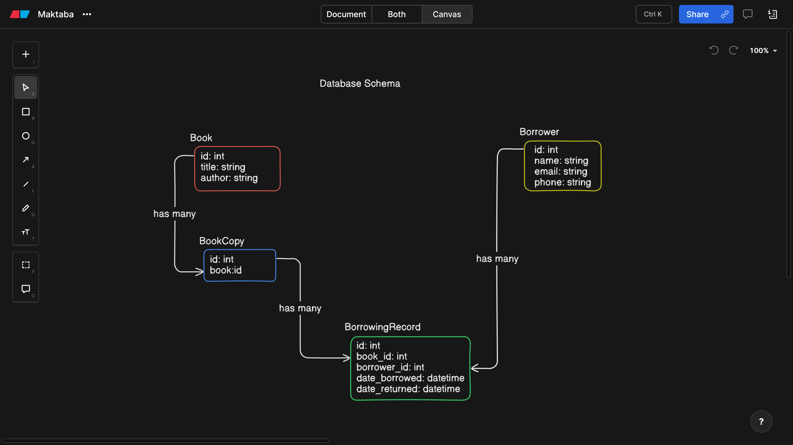

# Maktaba

Maktaba is a basic book lending library application built with Ruby on Rails 8. It allows users to manage books, track their lending history, and facilitate book borrowing and returns without requiring authentication.

## **📖 Table of Contents**
1. [Problem Statement](#problem-statement)  
2. [📦 Running the Application](#-running-the-application)  
   - [Prerequisites](#prerequisites)  
   - [🔧 Setup & Run](#-setup--run)  
   - [🛠️ Managing the App](#️-managing-the-app)  
   - [🏗️ Running Background Jobs](#️-running-background-jobs)  
3. [🧑‍💻 Development (Optional)](#-development-optional)  
4. [Thought Process and Implementation Logic](#thought-process-and-implementation-logic)  
   - [Functional Requirements](#functional-requirements)  
   - [Non-functional Requirements](#non-functional-requirements)  
5. [Views](#views)  
6. [User Persona](#user-persona)  
   - [User Journey](#user-journey)  
     - [Creating and Maintaining a Book Record](#creating-and-maintaining-a-book-record)  
     - [Facilitating the Borrowing of a Book](#facilitating-the-borrowing-of-a-book)  
     - [Confirming Book Return](#confirming-book-return)  
7. [📜 License](#-license) 

## Problem Statement
The goal is to create a system where a librarian can record book details, track lending activity, and ensure data integrity. Users should be able to:
- Create, view, update, and delete books.
- Record book borrowings and returns, including the borrower's name.
- View borrowing history for books and individual borrowers.

## 📦 Running the Application

### Prerequisites
Ensure you have the following installed:
- [Docker](https://docs.docker.com/get-docker/)
- [Docker Compose](https://docs.docker.com/compose/install/)

### 🔧 Setup & Run
1. **Clone the repository**
   ```sh
   git clone git@github.com:hanselomondi/Maktaba.git
   cd maktaba
   ```

2. **Create an `.env` file**
   ```sh
   echo "RAILS_MASTER_KEY=jmtiUuwMyvsJhrfs5Xr9GgLJc0cxN57/R8gKPuFsQZFK5Z1aAL+l4k/7pfZZqsQosE/SvFzy8DbPzM1OP9VKIjzi5UL4b8rmooK7bQnOmkwFXjOlC9fEP2ylG629+QAbvjJz5xdzBjzXdrGtZ9xy1lLXgMpOMu1T7nrHozaQrPYV3zYD2c5v0qeXF7k4mJ6aNgmbQOCYkW5cvjCfl8k8xC0U+OFmBDKw87XSWlI9EbuSHA70ryeq+MFuVie5WUduNpTX+DmtHhmcumVsmCzbGMM2puxjjQh20ObELqZxmV/Rdgc30cTSmXHSWaOMwcO+fOF0CEABtwajxwdXoTKSClxGxIc0lrybWbYeOc0wsgiv9z++js+Hjg7OiEIzP7WKGomBqKK6bvKZQ10IOsxRzQrFHgPadMlcOs1ZyhsaNe0NigrWAUqGvRyM60KvRrwMLNNPAwXNqX6dnloLLYbJZcwnxb1GmN/eglQ9JxdY3VXYEXK8kkBjA64k--4yFXufDm+JV97m/V--5IrWNrA7R1X1woRhWEBrhQ==" > .env
   ```

3. **Build & Run the App**
   ```sh
   docker-compose up --build -d
   ```
   - The app runs on **http://localhost:80**
   - The SQLite database is persisted in a Docker volume

4. **Run Migrations (if needed)**
   ```sh
   docker exec -it maktaba bin/rails db:migrate
   ```

### 🛠️ Managing the App
- **View logs:** `docker-compose logs -f`
- **Stop the app:** `docker-compose down`
- **Restart the app:** `docker-compose up -d`

### 🏗️ Running Background Jobs
The app uses **Solid Queue** for background jobs.
To start the worker manually:
```sh
 docker-compose exec app bin/rails solid_queue:work
```

## 🧑‍💻 Development (Optional)
If you prefer local development **without Docker**, follow these steps:
1. Install **Ruby 3.3.7** and **Bundler**
2. Install dependencies: `bundle install`
3. Setup database: `bin/rails db:setup`
4. Start the server: `bin/rails server`

## Thought Process and Implementation Logic

### System Overview


### Functional Requirements
- CRUD operations for books.
- Lending and returning books with borrower information.
- Viewing book details and borrowing history.

### Non-functional Requirements
- Model validations to ensure data integrity.
- Basic model and controller tests.

## Views
- **Book List:** Shows all books.
- **Book Details:** Displays book info and borrowing history.
- **Borrow Book:** Allows a book to be borrowed.
- **Return Book:** Updates a borrowing record when a book is returned.

## User Persona
**Jane** - A librarian responsible for maintaining the book inventory and tracking borrowing activity.

### User Journey

#### Creating and Maintaining a Book Record
1. Jane adds a new book with its details.
2. She can update or delete book records when necessary.

#### Facilitating the Borrowing of a Book
1. A borrower requests a book.
2. Jane checks if they are registered. If not, she registers them.
3. She records the borrowing transaction.
4. The book is marked as unavailable until returned.

#### Confirming Book Return
1. The borrower returns the book.
2. Jane finds the book’s latest borrowing record.
3. She updates it to mark the book as returned.
4. The book is available for borrowing again.


## 📜 License
This project is licensed under the MIT License.

